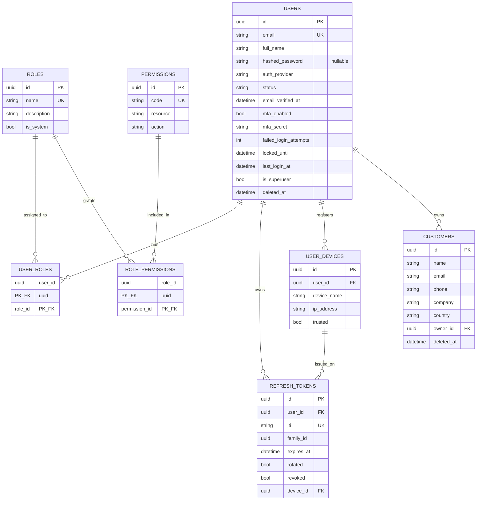
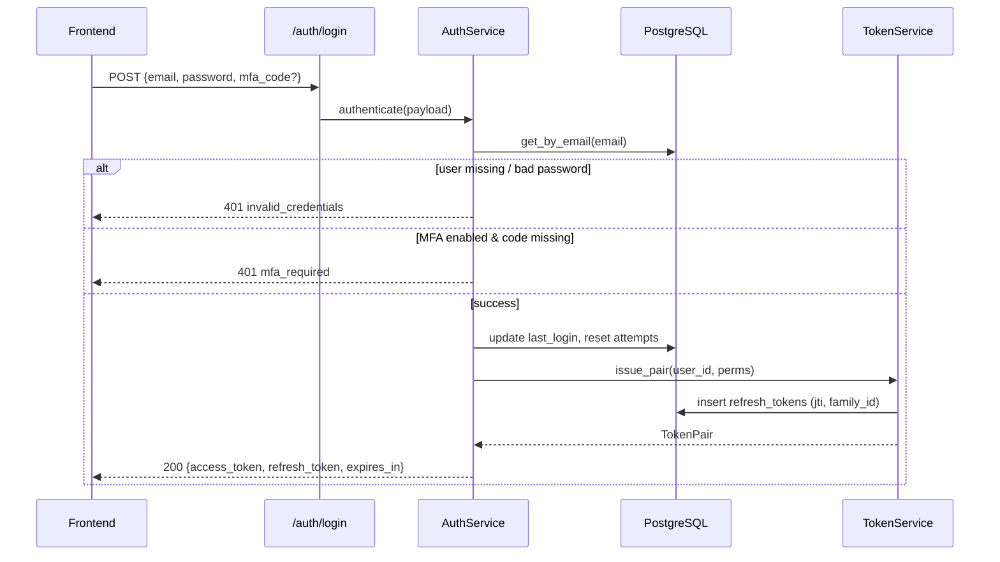
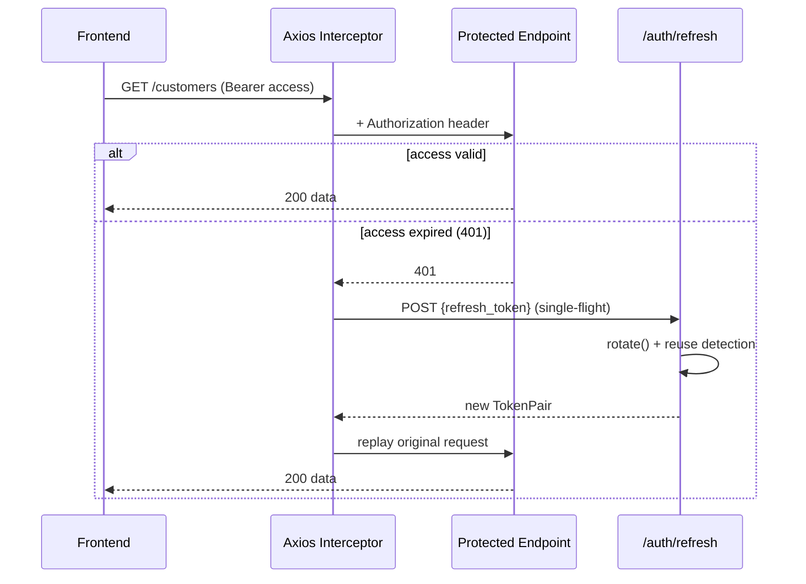
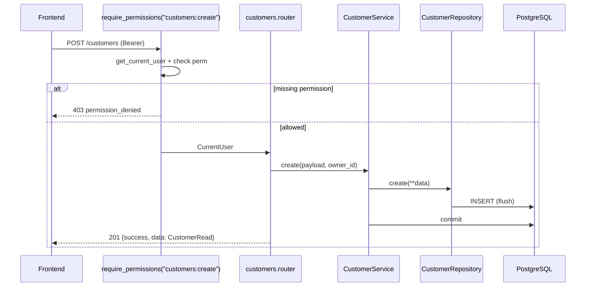

# Agri360 — Full‑Stack Developer Documentation

> Generated: 2026‑06‑28
> Backend: `~/Desktop/my_Projects/fastapi-backend` (FastAPI + PostgreSQL + Redis + Celery)
> Frontend: `~/Desktop/my_Projects/Agri360` (React 19 + TypeScript + Vite CRM)

This document is the single onboarding reference for a new developer. It covers the backend API surface, the database schema, the auth flow, how the frontend talks to the backend, and a prioritized list of improvements.

---

## Table of Contents

1. [Executive Summary & Key Findings](#1-executive-summary--key-findings)
2. [Project Folder Structure](#2-project-folder-structure)
3. [API Endpoint Reference](#3-api-endpoint-reference)
4. [Database Documentation](#4-database-documentation)
5. [ER Diagram (Mermaid)](#5-er-diagram-mermaid)
6. [Pydantic Schemas](#6-pydantic-schemas)
7. [Authentication & Authorization Flow](#7-authentication--authorization-flow)
8. [How the Frontend Calls the Backend](#8-how-the-frontend-calls-the-backend)
9. [Sequence Diagrams](#9-sequence-diagrams)
10. [Unused / Unimplemented APIs & Models](#10-unused--unimplemented-apis--models)
11. [Frontend ↔ Backend Contract Mismatches](#11-frontend--backend-contract-mismatches-critical)
12. [Improvement Suggestions](#12-improvement-suggestions)
13. [Local Development Setup](#13-local-development-setup)

---

## 1. Executive Summary & Key Findings

**Agri360** is an enterprise agriculture CRM. The repository is split into two independent projects:

| Project | Stack | Maturity |
|---------|-------|----------|
| **Backend** (`fastapi-backend`) | FastAPI, SQLAlchemy 2 (async), PostgreSQL, Redis, Celery, Alembic | **Scaffolding stage** — robust infrastructure, but only 3 functional modules (`health`, `auth`, `customers`). ~15 other domain modules are empty placeholders. |
| **Frontend** (`Agri360`) | React 19, TypeScript, Vite, TanStack Query, Zustand, Axios | **Feature‑complete shell** — 27 feature modules wired with API clients, but currently running against a **mock API** (`VITE_ENABLE_MOCK_API=true`). |

### Most important things to know

1. **The frontend is far ahead of the backend.** The frontend defines API clients for 27 resources (customers, products, sales, invoices, payments, suppliers, farmers, dealers, inventory, etc.). The backend currently *implements only* `auth`, `customers`, and `health`. Everything else returns nothing because the routers don't exist yet.
2. **The two are not contract‑compatible** today even for the modules that do exist (URL prefix, response envelope, casing, HTTP verb, and auth endpoint differences). See [§11](#11-frontend--backend-contract-mismatches-critical).
3. The backend architecture is genuinely production‑grade: clean layering (router → service → repository → model), RBAC, refresh‑token rotation with reuse detection, Argon2id hashing, RS256 JWTs, soft deletes, a standard response envelope, structured logging, Prometheus metrics, and rate‑limit scaffolding.

---

## 2. Project Folder Structure

### 2.1 Backend (`fastapi-backend`)

The backend uses a **module‑first (vertical slice)** layout: everything about a domain lives in one folder (`models → schemas → repository → service → router`).

```
fastapi-backend/
├── app/
│   ├── main.py                     # App factory (create_app), middleware wiring, lifespan
│   ├── api/
│   │   ├── deps/                   # Dependency-injection surface
│   │   │   ├── auth.py             # get_current_user, require_permissions, service factories
│   │   │   └── database.py         # db_session (request-scoped AsyncSession)
│   │   └── v1/router/__init__.py   # Aggregate API v1 router (mounts module routers)
│   ├── core/
│   │   ├── config.py               # Pydantic Settings (12-factor env config)
│   │   ├── security.py             # Argon2id hashing + JWT encode/decode (RS256/HS256)
│   │   ├── exceptions.py           # Domain exception hierarchy (AppException + subtypes)
│   │   ├── exception_handlers.py   # Global handlers → standard error envelope
│   │   ├── redis.py                # Redis pool lifecycle
│   │   ├── rate_limit.py           # Rate-limit config
│   │   └── logging.py              # structlog JSON logging
│   ├── db/
│   │   ├── base.py                 # DeclarativeBase + naming conventions
│   │   ├── mixins.py               # UUIDPkMixin, TimestampMixin, SoftDeleteMixin
│   │   ├── session.py              # Async engine + session factory
│   │   ├── unit_of_work.py         # UnitOfWork (multi-repo atomic transactions)
│   │   ├── models_registry.py      # Imports all models so Alembic sees them
│   │   ├── repositories/base.py    # Generic async CRUD repository
│   │   └── migrations/             # Alembic env + versions
│   ├── modules/                    # Domain modules (vertical slices)
│   │   ├── auth/                   # ✅ register/login/refresh/logout/me/mfa + token & MFA services
│   │   ├── customers/              # ✅ full CRUD reference template
│   │   ├── health/                 # ✅ liveness/readiness probes
│   │   ├── users/                  # ⚠️ models + repository only (no router)
│   │   ├── roles/                  # ⚠️ models only
│   │   ├── permissions/            # ⚠️ models only
│   │   └── products, leads, orders, kyc, notifications, reports,
│   │       file_uploads, audit_logs            # ❌ empty placeholders
│   ├── common/
│   │   ├── schemas/                # ResponseEnvelope, Meta, PageParams, Page
│   │   └── enums/                  # UserStatus, AuthProvider, LeadStatus, OrderStatus, …
│   ├── integrations/
│   │   ├── oauth/providers.py      # Authlib OAuth (Google, Microsoft) registry
│   │   ├── email/                  # (placeholder)
│   │   └── storage/                # (placeholder, S3)
│   ├── middleware/                 # SecurityHeaders, RequestContext
│   ├── monitoring/metrics.py       # Prometheus middleware + /metrics
│   └── workers/                    # Celery app + tasks (email, audit)
├── tests/                          # unit / integration / api / factories
├── deploy/                         # Dockerfile, nginx.conf, prometheus.yml
├── docs/ARCHITECTURE.md            # Architecture deep-dive
├── alembic.ini, pyproject.toml, docker-compose.yml, .env.example
```

**Layered request flow inside a module:**

```
HTTP request
  → router.py        (thin controller: validate → call service → wrap in envelope)
  → service.py       (business rules, transaction boundary / commit)
  → repository.py    (the only layer that touches SQLAlchemy)
  → models.py        (ORM entities)
```

### 2.2 Frontend (`Agri360`)

The frontend uses a **feature‑first clean architecture** (`api → service → hook → page`).

```
Agri360/src/
├── app/                    # App shell: layouts, guards, providers, router, global stores
│   ├── guards/             # ProtectedRoute, GuestRoute, PermissionGuard
│   ├── store/              # Zustand: auth.store, theme.store, ui.store
│   └── router/             # createBrowserRouter, feature route aggregation, navigation config
├── common/
│   ├── api/                # axios instance, interceptors, token store, refresh logic, apiClient facade
│   ├── config/env.ts       # Typed env (VITE_*) accessor
│   ├── constants/          # STORAGE_KEYS, ROUTES, QUERY_KEYS
│   ├── hooks/              # useAuth, usePermissions, useApi
│   └── types/              # PaginatedResponse, AuthUser, AuthTokens, ApiError
├── features/               # 27 domains, each with api/ services/ hooks/ pages/ types/ routes.ts
│   ├── authentication/  customers/  products/  sales/  invoices/  payments/
│   ├── suppliers/  farmers/  dealers/  inventory/  warehouse/  stock/  crop/
│   ├── farm-visits/  users/  roles/  permissions/  categories/  purchase/
│   ├── quotations/  delivery/  marketing/  notifications/  settings/  profile/  reports/
│   └── dashboard/
└── components/             # Shared UI primitives
```

---

## 3. API Endpoint Reference

> **Base URL:** all routes are mounted under `API_V1_PREFIX` = **`/api/v1`**.
> **Response shape:** every endpoint returns the standard envelope:
> ```json
> { "success": true, "data": <payload>, "error": null, "meta": { "request_id": "…", "page": 1, … } }
> ```
> **Auth:** "Yes" means a valid `Authorization: Bearer <access_token>` is required.

### 3.1 Health — `/api/v1/health`

| Method | URL | Purpose | Auth |
|--------|-----|---------|------|
| GET | `/api/v1/health/live` | Liveness probe (process up) | No |
| GET | `/api/v1/health/ready` | Readiness probe (DB + Redis reachable) | No |

**`GET /health/ready` response example:**
```json
{
  "success": true,
  "data": { "status": "ready", "checks": { "database": "ok", "redis": "ok" } },
  "error": null,
  "meta": { "request_id": "..." }
}
```

### 3.2 Authentication — `/api/v1/auth`

| Method | URL | Purpose | Request Body | Auth |
|--------|-----|---------|--------------|------|
| POST | `/api/v1/auth/register` | Create a local account (status `pending`) | `RegisterRequest` | No |
| POST | `/api/v1/auth/login` | Authenticate, return token pair | `LoginRequest` | No |
| POST | `/api/v1/auth/refresh` | Rotate refresh token → new pair | `RefreshRequest` | No (token in body) |
| POST | `/api/v1/auth/logout` | Denylist current access token | — (token in header) | Yes |
| GET | `/api/v1/auth/me` | Get the current principal | — | Yes |
| POST | `/api/v1/auth/mfa/setup` | Generate TOTP secret + provisioning URI | — | Yes |

- **Path params:** none. **Query params:** none.

**`POST /auth/register`**
```jsonc
// Request
{ "email": "jane@farm.io", "full_name": "Jane Doe", "password": "S3cure!passw0rd" }
// password: min 12 chars, must contain a non-alphanumeric character
// Response 201
{ "success": true, "data": { "id": "uuid", "email": "jane@farm.io", "status": "pending" } }
```

**`POST /auth/login`**
```jsonc
// Request
{ "email": "jane@farm.io", "password": "S3cure!passw0rd", "mfa_code": "123456" }  // mfa_code optional
// Response 200
{
  "success": true,
  "data": {
    "access_token": "eyJhbGci...",
    "refresh_token": "eyJhbGci...",
    "token_type": "bearer",
    "expires_in": 900
  }
}
// Possible errors: invalid_credentials(401), account_locked(401),
//   email_not_verified(401), mfa_required(401)
```

**`POST /auth/refresh`**
```jsonc
// Request
{ "refresh_token": "eyJhbGci..." }
// Response: same TokenPair shape as /login. Reuse of a rotated token revokes the whole family.
```

**`GET /auth/me`**
```jsonc
{
  "success": true,
  "data": {
    "id": "uuid", "email": "jane@farm.io", "full_name": "Jane Doe",
    "is_superuser": false, "permissions": ["customers:read", "customers:create"]
  }
}
```

**`POST /auth/mfa/setup`**
```jsonc
{ "success": true, "data": { "secret": "JBSWY3DPEHPK3PXP", "otpauth_uri": "otpauth://totp/..." } }
```

### 3.3 Customers — `/api/v1/customers`

This is the canonical CRUD module that every other domain module is meant to copy.

| Method | URL | Purpose | Permission Required | Auth |
|--------|-----|---------|---------------------|------|
| POST | `/api/v1/customers` | Create a customer | `customers:create` | Yes |
| GET | `/api/v1/customers` | List customers (paginated) | `customers:read` | Yes |
| GET | `/api/v1/customers/{customer_id}` | Get one customer | `customers:read` | Yes |
| PATCH | `/api/v1/customers/{customer_id}` | Partial update | `customers:update` | Yes |
| DELETE | `/api/v1/customers/{customer_id}` | Soft delete | `customers:delete` | Yes |

- **Path params:** `customer_id` (UUID).
- **Query params (list):** `page` (≥1, default 1), `page_size` (1–200, default 20), `sort` (column name), `order` (`asc`|`desc`, default `desc`).

**`POST /customers` — request:**
```json
{ "name": "Acme Agro", "email": "ops@acme.io", "phone": "+91...", "company": "Acme", "country": "IN" }
```

**`GET /customers` — response (paginated):**
```jsonc
{
  "success": true,
  "data": [
    {
      "id": "uuid", "name": "Acme Agro", "email": "ops@acme.io",
      "phone": "+91...", "company": "Acme", "country": "IN",
      "owner_id": "uuid", "created_at": "2026-06-01T...", "updated_at": "2026-06-01T..."
    }
  ],
  "error": null,
  "meta": { "page": 1, "page_size": 20, "total_items": 1, "total_pages": 1 }
}
```

**`PATCH /customers/{id}` — request (any subset):**
```json
{ "phone": "+91 99999 99999", "company": "Acme Agro Pvt Ltd" }
```

**`DELETE /customers/{id}` — response:**
```json
{ "success": true, "data": { "detail": "Customer deleted." } }
```

### 3.4 Non‑module routes

| Method | URL | Purpose | In OpenAPI schema |
|--------|-----|---------|-------------------|
| GET | `/` | Service banner `{ "service": "...", "docs": "/docs" }` | No |
| GET | `/docs` | Swagger UI | — |
| GET | `/redoc` | ReDoc | — |
| GET | `/api/v1/openapi.json` | OpenAPI spec | — |
| GET | `/metrics` | Prometheus metrics (if enabled) | No |

---

## 4. Database Documentation

8 tables/associations exist (5 entities + 2 association tables + 1 token table + 1 device table). All entities use **UUID primary keys** (`gen_random_uuid()` server default, requires the `pgcrypto` extension enabled in migration `0001`).

### Mixins applied to entities

| Mixin | Columns added | Notes |
|-------|---------------|-------|
| `UUIDPkMixin` | `id UUID PK` | default `uuid4` / server `gen_random_uuid()` |
| `TimestampMixin` | `created_at`, `updated_at` (`TIMESTAMPTZ`) | DB-maintained; `created_at` indexed |
| `SoftDeleteMixin` | `deleted_at` (`TIMESTAMPTZ`, nullable, indexed) | base repo filters these out |

### 4.1 `users`  *(UUIDPk + Timestamp + SoftDelete)*

| Column | Type | Constraints | Notes |
|--------|------|-------------|-------|
| id | UUID | PK | |
| email | VARCHAR(255) | UNIQUE, NOT NULL, indexed | |
| full_name | VARCHAR(150) | NOT NULL | |
| hashed_password | VARCHAR(255) | NULLABLE | null for OAuth-only accounts |
| auth_provider | VARCHAR(20) | NOT NULL, default `local` | enum: local/google/microsoft |
| status | VARCHAR(20) | NOT NULL, default `pending`, indexed | enum: active/inactive/pending/suspended |
| email_verified_at | TIMESTAMPTZ | NULLABLE | |
| mfa_enabled | BOOLEAN | NOT NULL, default false | |
| mfa_secret | VARCHAR(255) | NULLABLE | TOTP secret |
| failed_login_attempts | INTEGER | NOT NULL, default 0 | lockout counter |
| locked_until | TIMESTAMPTZ | NULLABLE | |
| last_login_at | TIMESTAMPTZ | NULLABLE | |
| is_superuser | BOOLEAN | NOT NULL, default false | bypasses RBAC (`*` permission) |
| created_at / updated_at / deleted_at | TIMESTAMPTZ | | from mixins |

**Relationships:** many‑to‑many to `roles` via `user_roles` (eager `selectin`).

### 4.2 `roles`  *(UUIDPk + Timestamp)*

| Column | Type | Constraints |
|--------|------|-------------|
| id | UUID | PK |
| name | VARCHAR(80) | UNIQUE, NOT NULL, indexed |
| description | VARCHAR(255) | NULLABLE |
| is_system | BOOLEAN | NOT NULL, default false (built-in, undeletable) |

**Relationships:** many‑to‑many to `permissions` via `role_permissions` (eager `selectin`).

### 4.3 `permissions`  *(UUIDPk + Timestamp)*

| Column | Type | Constraints | Notes |
|--------|------|-------------|-------|
| id | UUID | PK | |
| code | VARCHAR(150) | UNIQUE, NOT NULL, indexed | e.g. `customers:create` |
| description | VARCHAR(255) | NULLABLE | |
| resource | VARCHAR(80) | NOT NULL, indexed | e.g. `customers` |
| action | VARCHAR(40) | NOT NULL | e.g. `create` |

### 4.4 `customers`  *(UUIDPk + Timestamp + SoftDelete)*

| Column | Type | Constraints | Notes |
|--------|------|-------------|-------|
| id | UUID | PK | |
| name | VARCHAR(200) | NOT NULL, indexed | |
| email | VARCHAR(255) | NULLABLE, indexed | |
| phone | VARCHAR(40) | NULLABLE | |
| company | VARCHAR(200) | NULLABLE, indexed | |
| country | VARCHAR(2) | NULLABLE | ISO-3166 |
| owner_id | UUID | FK → `users.id` (ON DELETE SET NULL), indexed | multi-tenancy hook |
| created_at / updated_at / deleted_at | TIMESTAMPTZ | | |

### 4.5 `refresh_tokens`  *(UUIDPk + Timestamp)*

| Column | Type | Constraints | Notes |
|--------|------|-------------|-------|
| id | UUID | PK | |
| user_id | UUID | FK → `users.id` (CASCADE), indexed | |
| jti | VARCHAR(64) | UNIQUE, NOT NULL, indexed | links DB record to JWT |
| family_id | UUID | NOT NULL, indexed | rotation lineage |
| expires_at | TIMESTAMPTZ | NOT NULL | |
| rotated | BOOLEAN | NOT NULL, default false | |
| revoked | BOOLEAN | NOT NULL, default false | |
| device_id | UUID | FK → `user_devices.id` (SET NULL), NULLABLE | |

### 4.6 `user_devices`  *(UUIDPk + Timestamp)*

| Column | Type | Constraints |
|--------|------|-------------|
| id | UUID | PK |
| user_id | UUID | FK → `users.id` (CASCADE), indexed |
| device_name | VARCHAR(150) | NULLABLE |
| user_agent | VARCHAR(400) | NULLABLE |
| ip_address | VARCHAR(64) | NULLABLE |
| last_seen_at | TIMESTAMPTZ | NULLABLE |
| trusted | BOOLEAN | NOT NULL, default false |

### 4.7 Association tables

**`user_roles`**: `user_id` (FK users, CASCADE, PK) + `role_id` (FK roles, CASCADE, PK).
**`role_permissions`**: `role_id` (FK roles, CASCADE, PK) + `permission_id` (FK permissions, CASCADE, PK).

> ⚠️ **Migration note:** only `0001_enable_extensions` exists (it enables `pgcrypto`). **No table‑creating migration has been generated yet.** Run `alembic revision --autogenerate -m "create tables"` before the schema above exists in a real database.

---

## 5. ER Diagram (Mermaid)



---

## 6. Pydantic Schemas

All request/response DTOs are Pydantic v2. ORM models are never returned directly — schemas are the wire contract.

### Auth schemas (`app/modules/auth/schemas.py`)

| Schema | Fields (key constraints) |
|--------|--------------------------|
| `RegisterRequest` | `email: EmailStr`, `full_name: str(2–150)`, `password: str(12–128, must contain non-alphanumeric)` |
| `LoginRequest` | `email: EmailStr`, `password: str`, `mfa_code: str?` |
| `TokenPair` | `access_token`, `refresh_token`, `token_type="bearer"`, `expires_in: int` |
| `RefreshRequest` | `refresh_token: str` |
| `MFASetupResponse` | `secret`, `otpauth_uri` |
| `MFAVerifyRequest` | `code: str(6)` |
| `ForgotPasswordRequest` | `email: EmailStr` *(schema exists, no endpoint)* |
| `ResetPasswordRequest` | `token`, `new_password(12–128)` *(schema exists, no endpoint)* |
| `VerifyEmailRequest` | `token` *(schema exists, no endpoint)* |
| `CurrentUser` | `id`, `email`, `full_name`, `is_superuser`, `permissions: set[str]` |
| `SessionInfo` | `id`, `device_name?`, `ip_address?`, `user_agent?`, `last_seen_at?`, `trusted` *(schema exists, no endpoint)* |

### Customer schemas (`app/modules/customers/schemas.py`)

| Schema | Fields |
|--------|--------|
| `CustomerCreate` | `name(1–200)`, `email?`, `phone?(≤40)`, `company?(≤200)`, `country?(2)` |
| `CustomerUpdate` | all optional (PATCH semantics) |
| `CustomerRead` | `id`, `name`, `email?`, `phone?`, `company?`, `country?`, `owner_id?`, `created_at`, `updated_at` |

### Common schemas (`app/common/schemas/`)

| Schema | Purpose |
|--------|---------|
| `ResponseEnvelope[T]` | `success`, `data`, `error`, `meta` — wraps every response |
| `ErrorDetail` | `code`, `message`, `details?` |
| `Meta` | `request_id?`, `page?`, `page_size?`, `total_items?`, `total_pages?` |
| `PageParams` | query params: `page`, `page_size`, `sort`, `order` |
| `Page[T]` | repository result: `items`, `total`, `page`, `page_size`, `total_pages` |

---

## 7. Authentication & Authorization Flow

**Mechanism:** JWT (RS256 in prod, HS256 for local dev) + RBAC + optional TOTP MFA + OAuth2/OIDC (Google, Microsoft via Authlib, scaffolded).

### Token design
- **Access token:** short‑lived (15 min default). Carries `sub`, `type=access`, `jti`, `iat`, `nbf`, `exp`, `iss`, and `perms` (sorted permission codes).
- **Refresh token:** long‑lived (30 days). Carries a `family` claim and is persisted in `refresh_tokens`.
- **Revocation, two layers:**
  1. **Redis denylist** (`denylist:jti:<jti>`) — fast path checked on every request; logout adds the access `jti` with TTL = remaining lifetime.
  2. **`refresh_tokens` table** — durable rotation + reuse detection.

### Refresh‑token rotation with reuse detection (OWASP pattern)
- Each login starts a token **family** (`family_id`).
- Each refresh issues a NEW refresh token and marks the old one `rotated=true`.
- If an already‑rotated token is presented again → theft assumed → **the entire family is revoked**, forcing re‑login.

### Authorization (RBAC)
- `Permission` (atom, e.g. `customers:create`) → bundled into `Role` → assigned to `User`.
- Endpoints declare `require_permissions("customers:create")` as a dependency.
- `is_superuser` or the `"*"` permission bypasses all checks.
- `get_current_user` runs on every protected route: decode JWT → check denylist → load user (+roles+perms) → build `CurrentUser` principal.

### Password & lockout security
- **Argon2id** hashing (64 MiB, time_cost 3, parallelism 4); opportunistic rehash on login if params change.
- Dummy‑hash verification on unknown emails to equalize timing (anti‑enumeration).
- Account lockout after `ACCOUNT_LOCKOUT_MAX_ATTEMPTS` (5) for `ACCOUNT_LOCKOUT_DURATION_MINUTES` (30).
- Login blocked unless email verified and status not suspended.

---

## 8. How the Frontend Calls the Backend

### 8.1 Layered call chain
```
UI Page → React Query hook (useCustomers) → service (customersService)
        → api module (customersApi) → apiClient facade → axios instance (+interceptors) → HTTP
```

### 8.2 HTTP client (`src/common/api/`)
- **axios instance** — `baseURL = env.apiBaseUrl` (`VITE_API_BASE_URL`), `timeout = 30s`, JSON headers.
- **Request interceptor** — injects `Authorization: Bearer <access_token>` from `localStorage`.
- **Response interceptor** — on `401`, runs a **single‑flight** refresh against `POST /auth/refresh`, replays the original request once (`_retry` guard); on failure clears tokens and redirects to `/login`.
- **apiClient facade** — typed `get/post/put/patch/delete` returning `response.data`.

```ts
// src/common/api/interceptor.ts (response side, abridged)
if (status === 401 && original && !original._retry) {
  original._retry = true;
  const newToken = await refreshAccessToken();        // single-flight
  if (newToken) { original.headers.Authorization = `Bearer ${newToken}`;
                  return axiosInstance(original); }
  tokenStore.clear();
  window.location.assign(ROUTES.LOGIN);
}
```

### 8.3 State & storage
- **TanStack Query** — server cache (lists/details, `keepPreviousData` for pagination, `invalidateQueries` on mutations).
- **Zustand** — `auth.store` (user, isAuthenticated, permissions Set), `theme.store`, `ui.store`.
- **Tokens & user** persisted in `localStorage` under the `agri360.auth.*` namespace.

### 8.4 Environment config
| Variable | Current `.env` value | Meaning |
|----------|----------------------|---------|
| `VITE_API_BASE_URL` | `https://api.agri360.example.com/v1` | API base (default `/api`) |
| `VITE_ENABLE_MOCK_API` | `true` | **Frontend currently runs on mocks** |
| `VITE_AUTH_STORAGE_KEY` | `agri360.auth` | localStorage namespace |
| `VITE_API_TIMEOUT` | `30000` | request timeout (ms) |

---

## 9. Sequence Diagrams

### 9.1 Login (with optional MFA)


### 9.2 Authenticated request + refresh on 401


### 9.3 Customer create (RBAC enforced)


---

## 10. Unused / Unimplemented APIs & Models

### Empty placeholder modules (folders with only `__init__.py`, no router mounted)
`products`, `leads`, `orders`, `kyc`, `notifications`, `reports`, `file_uploads`, `audit_logs`, plus `roles`/`permissions`/`users` which have models but **no routers**.

### Backend assets defined but not wired
| Asset | Status |
|-------|--------|
| `users`, `roles`, `permissions` models | Defined, migrated‑intent, but **no CRUD endpoints** to manage them |
| `RefreshToken.is_active`, `revoke_all_for_user()` | Implemented, not yet called by any route |
| `UserDevice` table & `SessionInfo` schema | Defined, no "my sessions / revoke device" endpoint |
| `ForgotPasswordRequest`, `ResetPasswordRequest`, `VerifyEmailRequest` schemas | Defined, **no matching endpoints** |
| OAuth providers (`integrations/oauth`) | Registered, but **no `/auth/oauth/...` routes** call them |
| `CustomerRepository.search()` | Implemented, not exposed via a route |
| Celery tasks (`email`, `audit`) | Defined, not dispatched from auth/customer flows |
| `LeadStatus`, `OrderStatus`, `KYCStatus`, `NotificationChannel` enums | Defined for future modules, unused |

### Frontend API clients with no backend counterpart
27 feature API modules exist; only **customers** (and auth) have a real backend. The rest (`products`, `sales`, `invoices`, `payments`, `suppliers`, `farmers`, `dealers`, `inventory`, `warehouse`, `stock`, `crop`, `farm-visits`, `categories`, `purchase`, `quotations`, `delivery`, `marketing`, `notifications`, `reports`, `users`, `roles`, `permissions`, `dashboard`, `settings`, `profile`) would 404 against the live API — they only work today via the **mock API**.

---

## 11. Frontend ↔ Backend Contract Mismatches (Critical)

Even for the modules that *do* exist on both sides, the contracts do not match. Resolve these before disabling the frontend mock.

| # | Area | Frontend expects | Backend provides | Fix |
|---|------|------------------|------------------|-----|
| 1 | **Base URL** | `/v1` (`https://api.agri360.example.com/v1`) | `/api/v1` | Align `VITE_API_BASE_URL` to `…/api/v1` |
| 2 | **Response shape** | bare `{ data, total, page, limit }` for lists; bare object for detail | envelope `{ success, data, error, meta }` with pagination in `meta` | Add a frontend response unwrapper, or change backend (envelope is better — keep it, unwrap on FE) |
| 3 | **Token casing** | `accessToken` / `refreshToken` | `access_token` / `refresh_token` | Map in the auth service |
| 4 | **Refresh body** | `{ refreshToken }` | `{ refresh_token }` | Align casing |
| 5 | **Login response** | `{ accessToken, refreshToken, user }` | `TokenPair` only (no `user`) — `user` comes from `/auth/me` | FE should call `/auth/me` after login, or BE should embed user |
| 6 | **Update verb** | `PUT /customers/:id` | `PATCH /customers/:id` | Switch FE to PATCH (matches partial‑update semantics) |
| 7 | **Missing endpoints** | `/auth/forgot-password`, `/auth/reset-password` | not implemented | Implement on backend (schemas already exist) |
| 8 | **Pagination params** | `page`, `limit` | `page`, `page_size` | Align param names |
| 9 | **Error shape** | `{ message, code, errors }` | `{ error: { code, message, details } }` | Align FE error normalizer to envelope |

---

## 12. Improvement Suggestions

### 🔒 Security
1. **Tighten CORS** — `allow_methods=["*"]`/`allow_headers=["*"]` with `allow_credentials=True` is broad; pin to the methods/headers actually used.
2. **Persist `mfa_enabled`** — `/auth/mfa/setup` stores the secret but there is no `/auth/mfa/verify` to confirm and flip `mfa_enabled=true`; add it so MFA can actually be turned on.
3. **Refresh token in body** — the frontend stores tokens in `localStorage` (XSS‑exposed). Consider httpOnly secure cookies for the refresh token + CSRF protection.
4. **Rate limiting is configured but verify it's applied** — `RATE_LIMIT_AUTH`/`RATE_LIMIT_DEFAULT` exist; ensure the limiter middleware actually decorates auth routes.
5. **Add account‑enumeration parity to `/register`** — registration reveals whether an email exists via `conflict`. Consider a neutral response + email‑based notification.
6. **Email verification + password reset flows** are unimplemented despite schemas — users registered as `pending` can never log in until these ship.
7. **Generate JWT keys** — RS256 needs `./keys/*.pem`; document/automate key generation, and never commit them.

### ⚡ Performance
1. **`User.roles` uses `lazy="selectin"` globally** — every user load eager‑loads roles+permissions (two extra queries). Fine for auth, but consider a lighter load path for bulk user listings.
2. **List endpoints do `COUNT(*)` on a subquery every call** — for large tables add keyset/cursor pagination or cache counts.
3. **Add DB indexes for common filters** as real modules land (e.g. composite `(owner_id, deleted_at)` on customers).
4. **Redis connection reuse** — confirm the denylist check (`is_denylisted`) on every request uses the pooled client (it does) and consider a local LRU for very hot tokens.

### 🧱 Code Organization / Maintainability
1. **Ship the empty modules using the customers template** — `users`, `roles`, `permissions` especially, so RBAC is actually administrable via the API.
2. **Move `get_service` factories out of routers** — `customers.router` defines `get_service` inline; standardize these in `api/deps` like auth does.
3. **Generate the schema migration** — autogenerate the table‑creating Alembic revision; CI should fail if models drift from migrations.
4. **Contract testing / shared types** — generate a TypeScript client from the backend OpenAPI (`openapi-typescript` / `orval`) to eliminate the §11 mismatches structurally.
5. **Add tests** — only `test_security.py` and `test_health.py` exist; add service + API tests for auth and customers (factories scaffold is already present).
6. **Turn off the frontend mock per‑feature** as backend modules ship, rather than a global flag, to integrate incrementally.

---

## 13. Local Development Setup

### Backend
```bash
cd ~/Desktop/my_Projects/fastapi-backend
cp .env.example .env                 # fill SECRET_KEY, Postgres, Redis
# generate RS256 keys (or set JWT_ALGORITHM=HS256 for local)
mkdir -p keys
openssl genpkey -algorithm RSA -out keys/private.pem
openssl rsa -pubout -in keys/private.pem -out keys/public.pem

docker-compose up -d postgres redis  # infra
alembic upgrade head                 # runs 0001; then autogenerate table migration
alembic revision --autogenerate -m "create tables"
alembic upgrade head
uvicorn app.main:app --reload        # http://localhost:8000/docs
```

### Frontend
```bash
cd ~/Desktop/my_Projects/Agri360
pnpm install
# point at local backend & turn off mocks once endpoints exist:
#   VITE_API_BASE_URL=http://localhost:8000/api/v1
#   VITE_ENABLE_MOCK_API=false
pnpm dev                             # http://localhost:5173
```

### Useful URLs
| URL | What |
|-----|------|
| `http://localhost:8000/docs` | Swagger UI |
| `http://localhost:8000/redoc` | ReDoc |
| `http://localhost:8000/api/v1/health/ready` | Readiness probe |
| `http://localhost:8000/metrics` | Prometheus metrics |

---

*End of document.*
